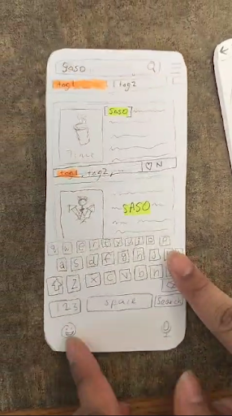
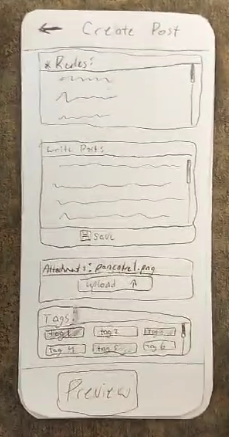
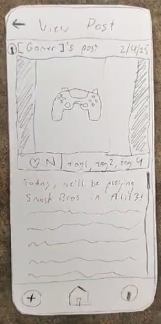
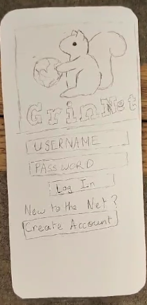
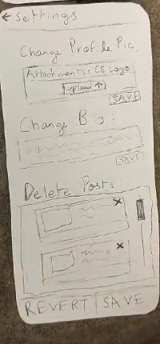
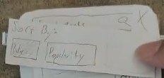
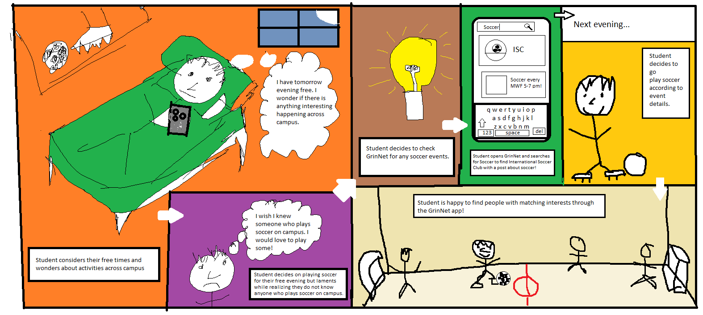

## Part 1: (Revise requirements)

<!-- Add a section to your Sprint Journal with the following:
- Summarize the feedback from your reviews.
- Describe the changes, if any, that you are making to your requirements, user personas, user stories, use cases, and prototype based on these reviews.
- Describe your rationale in deciding what changes to make (or not make) based on the reviews. -->

## Part 3: (Paper Prototype)

Below our pictures of our initial prototype. Our use cases in our first paper prototype include: 
 - Search
 - Create Post
 - Viewing and Showing Interest in Posts.
### 

    *Image 1: Search*

    *Image 2: Create Post*

    *Image 3: View Post*

Below are some other pictures that helped with the overall functionality of our program.

    *Image 4: Login*

    *Image 5: Settings*

    *Image 6: Sortby*

<!-- Add a section to your Sprint Journal with:
- One or more photos of your prototype
- You might also want to include photos of your team working on the prototype! (optional)
- Enumerate three use cases that the prototype models -->

## Part 4: (Test with classmate)

We tested our prototype with Muhammad, who played a regular user. For this test, Shibam played the computer, Jeronimo and Pranav were the facilitors, and Deven was the note-taker. This test activated the following user stories:
[still need to add user stories]

Muhammad already had some background knowledge of our app from the project proposals and Q&A ealier this semester, so we just started him off at the login page. He logged in and was brought to the homepage. He scrolled around, and started talking about what he thought each element on his screen was. He quickly figured out that we was looking at posts, and that the settings on the top were the categories. He used the search bar and searched for SASO. Once brought to SASO's user page, Muhammad scrolled through the page and clicked on a post. He observed that he knew what home button would do, but didn't know what the other two buttons on the bottom would do. Still on the SASO page, he clicked the plus to create a post, and was briefly confused about if he was making a post from the SASO account. He created his post and Shibam took him back home. After he clicked refresh, he saw his new post and tapped on it to confirm the details. Then he clicken on the bottom right to go to his own profile. He tied to change his profile picture by clicking on it, but when that didn't work he clicked the settings button. He made some changes to his profile, but then decided to revert them. Finally, Muhammad navigated back to the homescreen and experiemented with selecting tags.

Muhammad did very well at navigating the interface without help. Overall, he liked the interface, but got a little confused by the tags. He also mentioned that the Create Post page was a little cluttered. Since he was a classmate who heard the instructions for how to run a test session, he did a great job of talking through his thought process without even being asked. For future tests with shareholders who don't have as much context, we plan to be very explicit when telling the user to think out loud and explain every action they take.

### Changes to Prototype

<!-- Add a section to your Sprint Journal describing the test session.
- Who you tested it with.
- A narrative describing the test.
    - What roles did each team member play during the test?
    - Which user stories were activated?
    - Additional notes describing the session, e.g. observations of the test user's behavior.
- The feedback you got from the tester
- Notes on how to revise your testing procedure for the next user
    - Not only will your prototype change, but also, you might choose to change the way you present it to your user.
- Describe changes to your prototype
    - how your prototype changed based on user feedback
    - other changes your team decided to make from your own thoughts and ideas from the testing session
    - other things you added to your prototype, not necessarily based on the testing session
    - Include one or more photos of your revised prototype where the difference between the original and revised version can be plainly seen -->

## Part 5: (Test with shareholders)

### Shareholder 1: Becca, Regular User

We had Becca test our prototyope at 4:30 PM, Sunday Februrary 23. She was a naive user, and we chose her because she is not a Computer Science student and had no prior knowledge of our application / final project. She was also available at the most convenient times for our team (out of 2-3 other options for naive stakeholders).

For this test, Anthony played the computer, Shibam was the facilitor, and Deven and Pranav were note-takers. This test activated user stories that relate to posting, searching, and viewing posts.

The test session started off a little rocky. Anthony gave her the first screen (login), and Shibam told her to go ahead. Becca was very confused because she didn't understand that we were doing a paper prototype for an app, so Shibam explained a little bit of context. Becca clicked login, and scrolled through the posts and tabs. She clicked on one post, and Anthony gave her another screen showing the details of that post. She then clicked back to homepage and tried to look at another post, but we only had one screen detailing a post. She refreshed, which did not do anything, and then accidentally clicked on ther first post again. She was unable to scroll on this page because it did not have enough information to warrant a scroll bar. She then clicks on her own profile at the bottom, and taps create post. Anthony brings up the create post screen. She adds a picture, clicks review, and is brought to the review post screen. She clicks post and is brought back to homescreen. She tries to find her post but doesn't see it. She messes with the tags and then clicks the search bar, and Anthony brings up the search UI. She searches SASO and then goes back to the homescreen. After the test, we asked Becca several questions about the experience.

(Answers paraphrased) \
Q: How intuitive was the interface to use? \
A: Fairly intuitive. Like button and posts make sense, but the tags thing doesnt really make sense.

Q: Did you like the layout of the create post page/how would you improve it? \
A: I liked it. I wish that I could draft posts, and save posts I have liked. I want one page where I can see all of my liked posts. I also think that the rules for posts doesn't need to be on the screen every time I create a post.

Q: What kinds of actions would you like to perform on a user profile? \
A: I would expect there to be options like liking the page, liking the user, and commenting.

### Shareholder 2: John Robinson, Regular User

We had John test our prototype at 4:15 PM, Monday February 24. He was a naive user, and we chose him because [REASON].

For this test, Anthony played the computer, Jeronimo was the facilitator, and Deven was the note-taker. This test also activated uses stories that relate to posting, searching, and viewing posts.

This time, Jeronimo gave a very small amount of information about what we wanted our tester to do. We told John to be as transparent as possible, and to think out loud as he explored the app. John started on the login page, and tried to create an account. Anthony told him that for this, we would assume that he already had an account created, so John clicked login instead. Anthony brought up the homescreen, and John immediately remarked that he was reminded of Reddit. He clicked on a post, and Anthony brought him to the page for that post. At this point, John started to figure out what the app was, but was confused about the "N" placeholder for the number of likes. He went back to the homepage and pressed refresh, but nothing happened. He goes to the profile page, and says that he knew that would be what that button did. Anthony reccomended to hit the cog wheel for settings, and John liked the save and revert buttons at the bottom of the settings page. Then John clicked create post, and was brought to the post creation screen. After creating his post, he was brought back to the homescreen, and didn't really know what to do. We gave him some reccomendations for where to click, and he messed around with the tags. He specifically wondered how pressing multiple tags at once would work. Finally, he used the search bar, succesfullly searched for SASO, and then searched for "water bottle", but was met with no results. After the live test, Jeronimo read him a short description of the project so that he has all of the context, and then asked him some follow-up questions.

(Answers paraphrased) \
Q: Which buttons did what you expected them to do and which did not? \
A: The interface was pretty intuitive and it reminded me of apps like reddit and instagram. Most buttons were intuitive except for the refresh button, and the + at the bottom was not 100 % intuitive. I liked the post creation interface, and like that you can upload files, but it reminded me of navigating on a PC environment rather than on a phone. I liked the organization of posts, but I was wondering how the tags are sorted. I think that editing your own profile, is easier on instagram, but I likes that you can revert changes.

Q: Do you think you would use this app personally? \
A: I would use it, but only if it didn't feel demanding like email does. I would not come for personal posts, but rather to see events that are less known to the public. Even for a party scene it could be really helpful. 

Q: Do you think shitposting should be allowed on the app, or should it be restricted to posts about events? \
A: I think that not allowing shitpost would be best. Social media can be overwhelming, and trying not to overload the brain would be appreciated.

### Revision:

### Shareholder 3: Jessica Rodriguez Beyer - Non-naive Stakeholder Regular User & Administrator

This time, Jeronimo started by giving Jessica the prototype and instructing her to use it as if it were a phone. Since Jessica was already familiar with the project, she understood the purpose of the app and had a general idea of its features. We were aware of some of her general thoughts because we had previously discussed the app with her. Therefore, we asked her to be highly critical in her feedback.

We began by giving her the regular user prototype and asked her to explore all the functionalities she could think of within the app. Shibam told her to assume she had already used the app, so there was no need for her to create an account. The first thing Jessica did was scroll through the home page. She then clicked on the tags, explored them, and commented on the order of both the tags and the posts.

Next, she proceeded to create a post. She mentioned that she liked the inclusion of post guidelines but suggested that they could be displayed in a more space-efficient way, perhaps as a pop-up instead of a text box. She also pointed out that, since this was a mobile app, it would make more sense to have the photo gallery embedded in the post creation process rather than requiring users to upload a file manually.

Afterward, she used the search bar and then noted that she believed she had explored all possible functionalities in the prototype. At this point, Shibam asked her to try to "break" the app, and she was able to trigger the lost connection flow.

Jeronimo then introduced the initial administrator prototype, which was still in an early development phase. After pretending she already had an admin account, she proceeded to log in. She encountered the home admin page, which displayed three main functions available to the user: Rules, Issues, and Regular View. However, Shibam informed her that only the "Issues" option was functional at this stage.

Jessica selected the "Issues" option and was able to see a single account that had received multiple reports. She questioned why only one account was displayed and inquired about what would happen if multiple accounts appeared on the issues page—specifically, how admins would be able to select and search for different cases.

She then reviewed the three available actions: Warn, Ban, and Dismiss. She commented that these three actions seemed appropriate and sufficient.

That concluded the stakeholder meeting.

(Answers paraphrased) 
Q: Did you like the layout of the create post page/how would you improve it?
A:  Yes this layout. User would like to be able to see the picture instead of the name of the file (feels to PCish for a mobile app)  
Q: What kind of actions would you want to do on other user accounts?
A: Want a report, a follow button visible on the page without any further clicks, a block button
Q: Do you have any other suggestions for changes to the interface?
A: Want a tab for only the profiles you follow. Doesn’t want to have to scroll the whole feed to look for posts of accounts they are interested in. Want to be able to refresh the page by scrolling up at the top. Home button can just stay home button and even refresh the feed. 
I Want to be able to see their profile picture on the page and have a “logout” button in the settings section. Users would like to see the delete post option on each post instead of the profile settings.  

### Revision:

<!-- 
Add a section to your Sprint Journal for each set of revisions describing:
- Summarize the changes to your requirements after each test and describe why you made each change
- Summarize the changes to your prototype after each test and describe why you made each change
- Take a photo of the relevant parts of your prototype before and after the changes
    - Include 5 PAIRS of before/after photos (10 photos in total), clearly labeled -->

## Part 6: (Storyboard)

## Part 7: (CIDER Lab)

During the crique stage, we identified the following assumptions:
- Our app requires users to be able to see
- Our app requires users to have enough physical dexterity to tap on icons on the screens
- Our app requires users to be Grinnell college students/staff/faculty.

We picked the assuptions that users must be able to see to users must be able to see. This would exclude blind users, and it could also exclude users that can't see small text. Our app has many text boxes for writing and reading text, and no way to engage with posts without being able to see them.

There are several ways we could redesign our product to help with this. Elliot brought up the idea that many apps do not have built-in screen readers, but instead are designed carefully to be compatible with pre-existing tools. We could research the tools required and make appropriate changed to integrate with them. Additionally, we could add a text scale feature so that people who have trouble reading small text can enlarge it. This could also be a similar instance, where we could hopefully integrate our app with any text-scaling innate to the operating systems. 

<!-- Add a section to your Sprint Journal describing:
- Critique
    - What assumptions about users were identified during the critique stage?
- Imagine
    - Which assumption(s) did you choose to expand on for this phase?
    - How might that assumption exclude users?
- Design
    - What are your ideas for redesigning your product based on critique? -->
