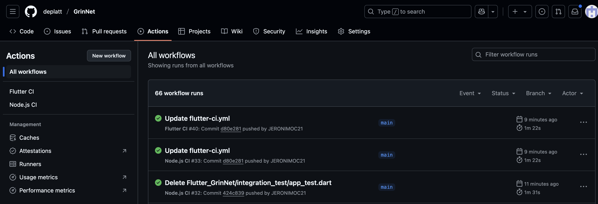

# Sprint 2 Journal

## Part 2: Software Architecture

<!-- For each of two decisions pertaining to your software architecture, identify and briefly describe an alternative. For each of the two alternatives, discuss its pros and cons compared to your choice. -->

1.7 Two Architectural Decisions & Their Alternatives 
Below are 2 notable choices, plus an alternative and brief pros/cons for each. 

Choice: Flutter for Front-End
Alternative: Native iOS (Swift) + Native Android (Kotlin).
Pros of Alternative: Optimal performance, platform-specific UIs.
Cons of Alternative: Double development effort, less code reuse, longer development cycles.
Rational : Given the time-constraints on our team this semester, we have decided that it is more viable for us to develop a single front-end using flutter rather than two separate native front-ends for iOS and Android. 

Choice: Node.js/Express for Back-End
Alternative: Ruby on Rails
Pros of Alternative: Rapid development with convention-over-configuration, built-in scaffolding.
Cons of Alternative: Smaller developer pool within the team (the team is more familiar with JS), potential overhead for real-time features.
Rational : The team members are more familiar with Node.js. Once again, given the time constraints and the fact that the team would have to spend time getting acquainted with Ruby on Rails, we have opted to use Node.js as our back-end. 

## Part 5: Process Description

### 5.1: Risk Assessment

<!-- In your Sprint Journal, write an entry to identify the top three risks to successful completion of your project.

For each, give:

- Likelihood of occurring (high, medium, low)
- Impact if it occurs (high, medium, low)
- Evidence upon which you base your estimates, such as what information you have already gathered or what experiments you have done
- Steps you are taking to reduce the likelihood or impact, and steps to permit better estimates
- Plan for detecting the problem (trivial example: running automated tests to determine that a file format has changed)
- Mitigation plan should it occur
- Be specific. If part of your risk analysis could be included in a different team's sprint journal, then you are probably not being specific enough. -->

#### Risk 1
One risk is that our group's collective inexperience at Firebase, PostreSQL, and Flutter will result in too much time being spent on troubleshooting. For example, Deven sat down to do a 1.5 hour long tutorial on Flutter, and ended up spending almost double that time just trying to install everything needed, so he wasn't even able to start the tutorial. Our current plan involves working with three databases, so we have a unique challenge in that there is a lot of different systems and libraries to learn. This risk has a high risk of occuring and a medium impact if it does occur. This is because it we will undoubtably have many moments when we are delayed by something being much harder to learn than expected, but unless it is happening repeatedly and severly, we will still be able to finish our product. One way of reducing the imapct of this is to not hesistate to reach out to the professor, class mentor, or other group members.  Atfer we have everything fully set up, it will be easier to have a better estimate of this risk because we will have finished with all the installation necessary. One way to detect this problem is through frequent check-ins, so we can find out if anyone has gotten stuck or is struggling understanding how to use a new tool. If that does happen, a way to mitigate this risk is to share what we already know about that tool or any good resources anyone has found on it. That way, nobody spends too much time stuck on a problem that another group member already knows how to solve.

#### Risk 2:
Another risk is our (relatively) homogenous group will result in us collectively missing a key accessiblity issue in our prodict. As we have dicussed several times, but most notably in the conversation about group diversity, our group is made up of five men who have been studying computer science for years. As the reading about diverse group points out, diverge groups are generally more successful, and it is very possible that our end product may inadvertantly be inaccessible in some way. We estimate this risk has medium risk and medium impact. We have spent lots of time in class thinking about accessibility, so this issue is on our radar. If it does happen, it will not result in a total failure of our product, but it is something we would like to avoid as much as we can. To reduce the likelyhood, we can spend more time talking about accessibiliy, and mitigate the risk by talking about our ideas with people outside of our group (and class!), which will help with the homoegeity problem. The more accessiblity features we add (or ensure compatability with), the better sense we will have of the accesibilty of our product and those estimates. Once we have a working demo, we can detect this problem by having a variety of different people test our product (like how we got lots of people to test our paper prototyope). To mitigate this risk, we can make it a priority to fix any issues when we find them. 

#### Risk 3:
Finally, there is the risk that we will need to fully rework our software architecture mid-project. This would most likely happen due to the databses. Right now we plan to use three of them for different purposes, but we may find that these three cannot communicate with each other and the frontend in the way that we intend for them to, or that it is horredously ineffiecent to do it this way. This risk as a low risk of occuring, but a high impact if it does. We have done lots of research and put a lot of thought up front into our software architecture, so we most likely will not need to completely redo it at any point. However, if it does happen, we will lose a lot of work and time that we put into the project, and we will most likely have to rewrite a lot of our backend, so it would be very hard to still complete the project on time. One way to mitigate the risk and impact (and get a better sense for the risk) is to create tracer code, like the reading from the Pragmatic Programmer mentioned. This will allow us to see how our components interact in code before we commit to fully implementing everything. This will also help us detect the problem, because hopefully we will see early if we need to rework anything. If we find that we do have to rework everything, we will mitigate the effects by trying to take away any lessons we learned about backend from implementing everything the first time. We will hold on to our old code and use it to recreate/rework what we need to.

### 5.2: Epics

<!-- An epic is a series of issues that come together to create an identifiable feature group. Completion of an epic may span multiple sprints.
Divide your planned work into about 3-6 epics. For each epic, write in your Sprint Journal:

- Description -- What will this epic achieve?
- Dependencies --  What (other epic) needs to be done before this epic can be started?
- Effort estimate -- How many person-week units do you expect it will take (If 3 team members will work on it for 2 weeks, that's 6 person-weeks.)
- Subtasks -- In the backlog of your Issue Manager, label tasks so they can easily be identified as part of the given epic. Create any relevant tasks that do not exist yet. Note that issues do not need to be well formed until they are added to the current sprint backlog. -->

#### Epic 1: User accounts + successful login
This epic will achieve a full integration of the user database and user log in, so the final goal will have a fully functional account creation, verification and login. What needs to be done for this epic to happen is we need to have successfully  learned how to integrate and connect our database to our app, completed our learning experiences regarding dart programming and have knowledge about firebase authentication a. In addition, some of the issues we have already worked on on previous milestones and sprints will come into play. Mainly, what we are doing in this sprint with the software design and architecture as well as our paper prototype. We estimate that the full implementation will take 8 person weeks, meaning that 4 of us will work for 2 weeks, to achieve our envisioned product. The epic will have the following issues: Design login page UI, Existing user login, Send new user an email with a verification link, Add functionality to email verification link, Integrating Flutter with Firebase, and set up error authentication handlers. 

#### Epic 2: Post Handling
This epic will include everything related to posts which include the post creation page, post visualization, post ordering, post termination, post reactions ,post identification via tags and post guidelines. This part of the project will include options that will set admins a part of regular users as an admin will have a different form of visualization as well as options for posts, given that a regular user can report a post and an admin can take it down for further revision. Additionally, we will include the post guidelines text box. What needs to be done for this epic to happen is we need to have successfully  learned how to integrate and connect our database to our app, particularly the PostgreSQL part as we will be managing the post storage there. Also we have to complete our learning experiences regarding dart programming and have knowledge about firebase authentication. In addition, some of the issues we have already worked on on previous milestones and sprints will come into play.  We estimate that the full implementation will take 9 person weeks, meaning that 3  of us will work for 3 weeks, to achieve our envisioned product.

#### Epic 3: Layouts 
This epic will achieve a complete User interface integration, meaning that all the visual components and layouts that we planned back in Sprint 1 will be integrated. This means that by the end of this Sprint we will have figured out most of the front end of the application, and we will have tested that every button works as intended. Also, by the end of this sprint, we should have successfully implemented several of the features such as having a search bar that works as intended meaning that it will be able to receive input and implement the search. A clear visualization of the FYP and the Setting page. For the setting page, we will be able to perform changes to the profile info by this point. What needs to be done for this epic to happen is we need to have successfully  learned how to integrate and connect our database to our app, completed our learning experiences regarding dart programming and have knowledge about firebase authentication a. In addition, some of the issues we have already worked on on previous milestones and sprints will come into play.  We estimate that the full implementation will take 12 person weeks, meaning that 4 of us will work for 3 weeks, to achieve our envisioned product. The epic will have the following issues: Create database that holds user data, Design user feed that shows the different posts, Create a search bar and create settings page. 

### 5.3: Product Roadmap

<!-- In your Sprint Journal, create a timeline or calendar to represent your product roadmap. You might experiment with different text or graphical formats to make a calendar that is easy for your team  to understand. In your roadmap, include:

- Approximate start date of each epic
- Approximate completion date of each epic
- Enough time for flexibility in case your approximations are off -->

## Part 6: Continuous Integration Plan

<!-- In your Sprint Journal, write a test plan, describing:

- Your test library (e.g., JUnit, Mocha, Pytest, etc).
- A brief justification for why you chose that test library.
- Your CI service and how your project repository is linked to it. (GitHub Actions is the recommended CI service.)
- A brief justification for why you chose that CI service. -->

### Continuous Integration Plan for Flutter 
The test library we are going to use is the built-in Flutter Testing Framework, that includes the   flutter_test for unit/widget tests and integration_test for end-to-end testing. The reasons why we are using this library are that it is compatible with flutter, provides sufficient tools for unit tests, widget tests and integration tests and works seamlessly with  Github Actions. Regarding the CI service, we are going to use github actions as it is the recommended and we are already doing 90% of the work on the github repository. 

### Continuous Integration Plan for Node.js
We opted for Mocha as our test library for Node.js, complimented by Chai for assertions, because their simplicity and strong community backing make them a natural fit for our Node.js environment. This decision is clearly reflected in our package.json, where Mocha is set up to run our tests with just a simple npm test command. On the continuous integration front, we decided to use GitHub Actions. Its integration with our repository allows us to automatically trigger tests on every push or pull request to the main branch. Our CI workflow installs our dependencies then runs our tests for node.js using a PostgreSQL database created in a Docker container. 

## Part 7: Test Automation and Continuous Integration Setup

    *Image 5.1.1: Screenshot of Successful Tests* 

<!-- In your Sprint Journal, include a screenshot of your successful tests to demonstrate that they have run and passed. -->

