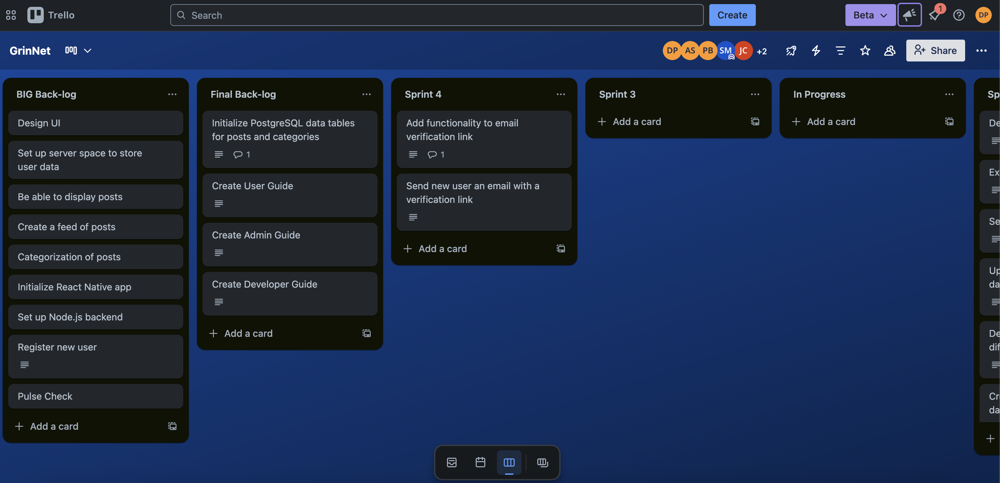
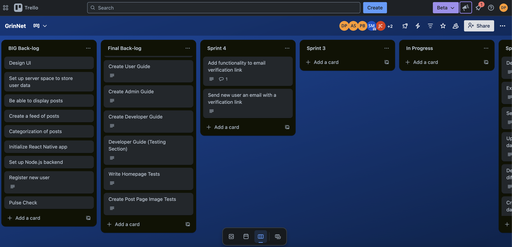

# Sprint 4 Journal

## Part 1: External Documentation and Stakeholder Meetings

<!-- In your Sprint Journal, add an entry that includes the following for each stakeholder:
-Who you met with
    -Name, occupation, and other relevant information about the stakeholder
    -Date and time of the stakeholder meeting
-Description of the test session and feedback
    -What was their behavior of interacting with the documentation?
    -Did they succeed or get stuck?
    -What feedback did they provide about documentation?
    -What questions did you ask, and what were the stakeholder's answers? -->

### Stakeholder 1:
Rebecca Boroda - Regular User, grinnell college student. Conducted on Tuesday, 22nd April, 2025 at 4:00 PM

Action to perform - Use Case 1 : Search 

Behavior interacting with the documentation : Becca found the documentation to be concise and easy to understand.

Success / failure in task : Becca succeeded in her task of searching through the search bar, although it took her a second to figure out the parameters she could search by. She finally ended up searching by content in the post, by tags, and by username (all 3 possibilities to search).

Feedback on documentation : Becca initially found the documentation to be a bit too concise, but after testing the app, she found it to be sufficient for the current state of the app. 

Questions asked to the stakeholder: 
How intuitive was the interface to use? Which buttons did what you expected/which did not?
4 out of 6. All the buttons did what was expected, except the profile page, where she expected to see her own profile and not various posts. However, the profile page simply had not been implemented yet.

Did you like the layout of the create post page/how would you improve it?
There should be a dedicated section in the post for date / time of event. 

Do you have any other suggestions for changes to the interface?
The interface is visually unappealing as things stand. 

Do you think you would use this app personally?
With an improved interface, I would possibly use it. 

How the product will be updated based on feedback : based on becca's and also jesica's feedback, we are planning to modify our event / post model to include dedicated sections to display the date and time that the event will take place. 

### Stakeholder 2:
Jesica Rodriguez Beyer - Regular User, grinnell college student. Conducted on Tuesday, 22nd April, 2025 at 6:00 PM

Action to perform - Use Case 2 : Create Post 

Behavior interacting with the documentation : Jesica found the documentation easy to understand. 

Success / failure in task : Jesica succeeded in her task of creating a post. She made on for Alice, choosing the tags for culture, music, and misc. She even added a random image from the device on which she conducted her test. 

Feedback on documentation : Jesica, like Becca, said the documentation was simple and concise.  

Questions asked to the stakeholder: 
How intuitive was the interface to use? Which buttons did what you expected/which did not?
Jesica found the existing interface to be decently intuitive, although she had a number of suggestions for changes to the interface (mentioned below)

Did you like the layout of the create post page/how would you improve it?
Jesica also mentioned that there should be a dedicated section in the post for date / time of event. 

Do you have any other suggestions for changes to the interface?
- be able to preview the image when it is uploaded
- create post interface should match what the actual post will look like
- the title of the event should be in bold to make it clear
- wants to be able to refresh the feed by scrolling down instead of a refresh button

Do you think you would use this app personally?
With an improved interface, I would possibly use it. 

How the product will be updated based on feedback : based on becca's and also jesica's feedback, we are planning to modify our event / post model to include dedicated sections to display the date and time that the event will take place. We will also make the event title bold. 

### Stakehodler 3:

## Part 2: Internal Documentation

<!-- As part of Sprint 4, you will submit the following deliverables as entries in your sprint journal:

For each subgroup
- Name the members of that subgroup
- Identify the code that you worked with in the lab (e.g. calico.java, lines 1-437)
- Write a paragraph to describe the changes that you made to the code and the documentation
- Identify existing documentation that was helpful
- Identify the commit hash of the commit in which you wrote your new documentation. Provide a Github link where your instructor can view the diff of that commit.
- If you created or updated any issues in your issue tracker, show a "before" and "after" snapshot of the detailed view of each issue so that the difference can clearly be seen -->

### Subgroup 1: Shibam, Pranav, and Anthony

Internal Documentation Lab: Partners: Shibam (Teammate A), Anthony and Pranav (Teammates B)
Code Selected: Flutter_GrinNet/lib/pages/create_post.dart (Lines 1 - 157)

**Teammate B Review:**

Task description : 
we arrive at the create post page by clicking on the “+” button. It  allows users to create a post, with or without an image, for other users to view. Could include the task description at the top of the file.

Changes needed :
Comments on some methods but not others. Ones without comments are _submitPost (line 41).

No comments on classes. Class CreatePostScreen (line 8), _CreatePostScreenState (line 15) needs comments.  

Additionally, widget build (line 88) is a big block of code with no in-line comments. While there is an explanatory comment at the start of the widget, it is difficult to follow along with the specifics of the internal code without further comments.  

Lastly, it would be very helpful for the class and method comments to include preconditions and postconditions, and parameters and exceptions (if applicable). This would help follow the logic of the code with much more ease. 

**Changes made :**

Added comments to all methods and classes along with widget build (the UI) explaining each line of code.

Commit Hash: 19885bc51ea79a51589c1562fd82dd97ddb80280

Commit link: https://github.com/deplatt/GrinNet/commit/19885bc51ea79a51589c1562fd82dd97ddb80280

### Subgroup 2: Deven and Jeronimo

We discussed the file CreatePost_test.dart. The only existing documentation we had for this code were the line-by-line comments in the code. This is very helpful documentation, as the code would be hard to read without them. 

We decided that it would be helpful to have more documentation in the code itself, as well are more related documentation in the Trello board. In the file, we added a block comment at the top with some basic information about the test suite and how the tests work. In the Trello board, we added a few issues for various test suites that we still need to write. This includes the last part of the create post tests (making it work with image selection on a phone), and testing pages that we have yet to create. We previously did not include testing in the issue tracker, which was an oversight because writing the test suites requires a significant amount of work. The changes the Trello board are shown in the screenshots below:

Before:

After:

Commit: 

## Part 3: MVP

<!-- In a Sprint Journal entry, remind us what your MVP is (look back to Milestone 1 where you described what features would be included in your MVP)
Describe what work, if any, remains toward delivering your MVP -->

Our MVP includes the following features:
- Making posts
- Viewing a feed of posts
- Categorization of posts based on topic
- Searching through exising posts
- Settings page
- User profile page to view your own posts
- Email verification for login
- System for account/password recovery
- Seamless sign-in and sign-out

We are nearly there when it comes to our MVP. The main things that remain are 
1. The full implementation of the "forgot password" feature for account recovery. We currently have a "forgot password" page available from the login screen for the user to enter their email, but it is not fully functional yet.
2. A scrollable tag bar at the top of the hompage for categorization of posts. Right now a user can search the name of a tag to get every post with that tag, so it could be argued that we have fulfilled the categorization requirement, but we think it will be easier for the user if we have a specific feature for this right on the homepage.
3. Full image support for making and viewing posts. We currently have a working system for storing images on the backend, but it isn't merged with the rest of our frontend yet.

## Part 4: Generative AI Experiment

<!-- For each use of AI this sprint, write an entry in your Sprint Journal including:
- Name the members of your team who tried it.
- Going into this use of AI, what were your goals and expectations?
- Describe the use specifically in detail. How did you prompt the AI, and what was its output?
- How did this use of AI affect your product development or other sprint deliverables? If you integrated any of its output directly into your code base, include a link to a pull request where the generated output can be clearly distinguished.
- Refer back to your answer to question 2. To what extent did the use of AI achieve your goals and conform to your expectations? -->

